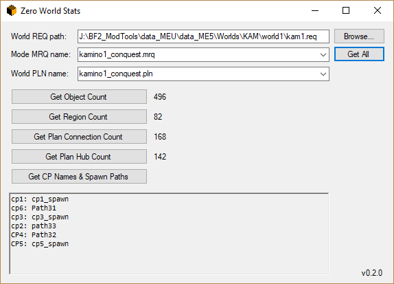

  

## About

This is a tool for Star Wars Battlefront II (2005) modders to display various world stats such as object count, region count, and plan connection and hub count.

## Installation

Download the [latest release](https://github.com/marth8880/ZeroWorldStats/releases/latest), extract the archive to any directory, and done! 

Please note that [.NET Framework 4](https://www.microsoft.com/en-us/download/details.aspx?id=17718) is required to run the application.

## Usage

- To launch the app, run ZeroWorldStats.exe from any directory.
- To get the stats of a world, first browse for the world's REQ file (via the "Browse" button). Then, select the relevant game mode and plan file from the dropdowns and click "Get All".

## Bugs & Suggestions

Find a bug or have a suggestion? Submit them [HERE](https://github.com/marth8880/ZeroWorldStats/issues).

## License

For license information, please see [HERE](LICENSE.md).
